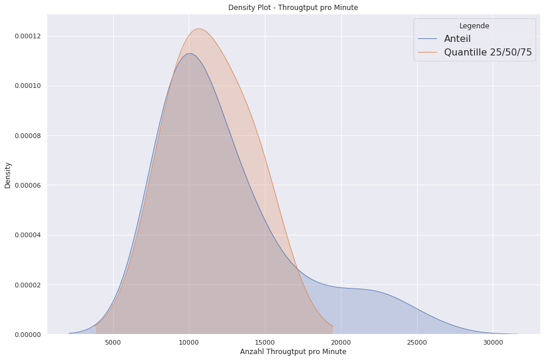
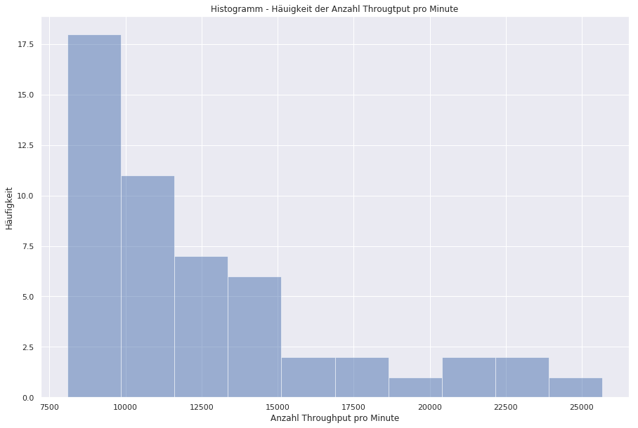
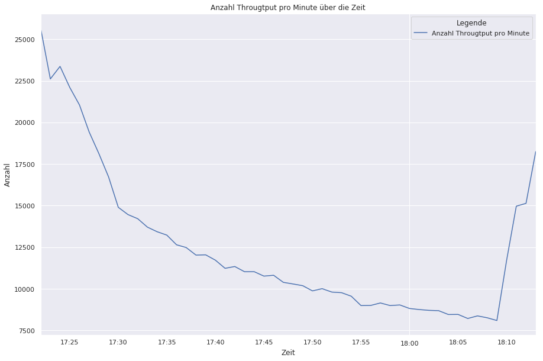
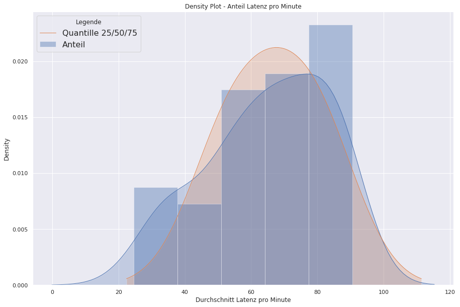
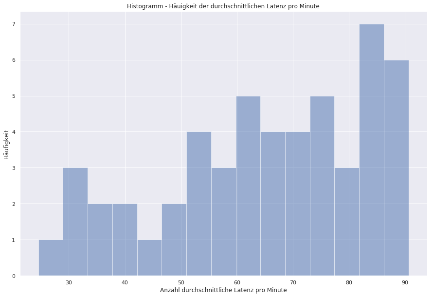
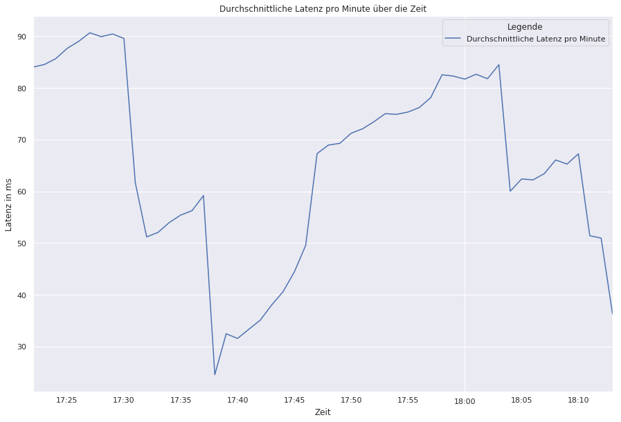

# Semesterarbeit MapReduce

## Aufgabe 1 - Throughput pro Minute

Philipp Dubach - CAS Big Data HS19/20

### Ausgangslage

Schreiben Sie ein MapReduce-Programm in Python (oder Java),
welches den Throughput pro Minute bildet 
serverseitiges Log - nur mw_trace50 nehmen 
darin nur res_snd Records beachten 
zählen, wie res_snd pro Minute anfielen (dazu den time-Wert ohne Rest durch 1000*60 dividieren). 
die Werte als CSV-Datei ausgibt 
Stellen Sie die Entwicklung mit geeigneten Mitteln graphisch dar 

### Vorgehen

Ich habe mir die Aufgabe genau durchgelesen und dann den Datensatz angeschaut.  
Im Prinzip war mir klar, dass es genauu gleich wie das Hello World Beispiel Word_Count funktionieren muss. 
Die Aufgabe hat zudem noch der Hinweis wie der Schlüssel generiert werden muss, was das Ganze ein 
wenig einfach gestaltet. 

Ich wusste so auf Anhieb, dass der Schlüssel die Minute sein muss 
ob das so funktioniert wusste ich jedoch so noch nicht. 

Somit habe ich es einfach mal versucht den Schlüssel so zu setzen. 
Den Wert welchen ich aus dem Mapper rausgebe, war dann lediglich eine 1 
welche ich dann im Reducer auf die Minuten aufsummiere. 

Ich habe dann herausgefunden, dass ich den Mapper zum Debuggen einzeln laufen lassen kann, 
was mir das ganze System ein wenig klarer erscheinen liess. 
(Quelle: https://mrjob.readthedocs.io/en/latest/job.html) 

Output des Mappers war dann der Key(jede Minute) mit jedem Value welchen ich als 1 definiert hatte. 
Nun musste ich nur noch den Reducer dazu bringen, nach dem Key zu Gruppieren und die Aggregation auf meinen Values 
zu erzwingen. 
Dazu habe ich den Key vom Mapper wieder als Key gesetzt und den Value habe ich dann summiert. 
Hat alles auf Anhieb geklappt 

Damit das Script bei grösseren Daten effizienter auf den Cluster laufen kann, 
habe ich zwischen Mapper und Reducer noch einen Combiner eingesetzt. 
Dieser Reduziert dann jeweils seinen Block bereits auf dem jeweiligen Node und 
sendet dann den bereits reduzierten Datensatz an den Reducer.  

Das Ganze habe ich mir dann in der Cli mittels stdout > als csv Datei abgespeichert.

### Ergebnis und Visualisation

Die Daten habe ich mir dann auf ein Git Repo gesendet damit ich es hier direkt nutzen kann, 
um den nachstehenden Code und dieses Dokument zu erstellen.

<b>Import Librarys</b>


```python
import pandas as pd
import matplotlib.pyplot as plt
from datetime import datetime
import seaborn as sns
from datetime import datetime
%matplotlib inline
```

<b>CSV in Pandas Datenframe laden</b>


```python
data_tp = pd.read_csv("https://raw.githubusercontent.com/dubachphil/bigdata/master/1_1_Dubach_Philipp.csv",
                   sep='\t',
                   names=["timestamp","count"],
                  header=None)
```

<b>Daten prüfen</b>


```python
data_tp.head()
```

<table border="1" class="dataframe">
  <thead>
    <tr style="text-align: right;">
      <th></th>
      <th>timestamp</th>
      <th>count</th>
    </tr>
  </thead>
  <tbody>
    <tr>
      <th>0</th>
      <td>1414252860</td>
      <td>8755</td>
    </tr>
    <tr>
      <th>1</th>
      <td>1414252920</td>
      <td>8707</td>
    </tr>
    <tr>
      <th>2</th>
      <td>1414252980</td>
      <td>8687</td>
    </tr>
    <tr>
      <th>3</th>
      <td>1414253040</td>
      <td>8458</td>
    </tr>
    <tr>
      <th>4</th>
      <td>1414253100</td>
      <td>8463</td>
    </tr>
  </tbody>
</table>
<div style="page-break-after: always;"></div>


```python
data_tp.describe()
```

<table border="1" class="dataframe">
  <thead>
    <tr style="text-align: right;">
      <th></th>
      <th>timestamp</th>
      <th>count</th>
    </tr>
  </thead>
  <tbody>
    <tr>
      <th>count</th>
      <td>5.200000e+01</td>
      <td>52.000000</td>
    </tr>
    <tr>
      <th>mean</th>
      <td>1.414252e+09</td>
      <td>12501.788462</td>
    </tr>
    <tr>
      <th>std</th>
      <td>9.092854e+02</td>
      <td>4440.705139</td>
    </tr>
    <tr>
      <th>min</th>
      <td>1.414251e+09</td>
      <td>8096.000000</td>
    </tr>
    <tr>
      <th>25%</th>
      <td>1.414251e+09</td>
      <td>9024.500000</td>
    </tr>
    <tr>
      <th>50%</th>
      <td>1.414252e+09</td>
      <td>11029.500000</td>
    </tr>
    <tr>
      <th>75%</th>
      <td>1.414253e+09</td>
      <td>14275.750000</td>
    </tr>
    <tr>
      <th>max</th>
      <td>1.414254e+09</td>
      <td>25669.000000</td>
    </tr>
  </tbody>
</table>


<b> Daten aufbereiten </b>


```python
data_tp["date_time"] = [datetime.fromtimestamp(int(i)) for i in data_tp["timestamp"]]
data_tp = data_tp.sort_values(by="date_time")
data_tp.head()
```

<table border="1" class="dataframe">
  <thead>
    <tr style="text-align: right;">
      <th></th>
      <th>timestamp</th>
      <th>count</th>
      <th>date_time</th>
    </tr>
  </thead>
  <tbody>
    <tr>
      <th>16</th>
      <td>1414250520</td>
      <td>25669</td>
      <td>2014-10-25 17:22:00</td>
    </tr>
    <tr>
      <th>17</th>
      <td>1414250580</td>
      <td>22612</td>
      <td>2014-10-25 17:23:00</td>
    </tr>
    <tr>
      <th>18</th>
      <td>1414250640</td>
      <td>23366</td>
      <td>2014-10-25 17:24:00</td>
    </tr>
    <tr>
      <th>19</th>
      <td>1414250700</td>
      <td>22102</td>
      <td>2014-10-25 17:25:00</td>
    </tr>
    <tr>
      <th>20</th>
      <td>1414250760</td>
      <td>21049</td>
      <td>2014-10-25 17:26:00</td>
    </tr>
  </tbody>
</table>
<div style="page-break-after: always;"></div>

<b>Erster Plot - Density Plot</b> 
Der Plot zeigt wie der Anteil des Througtput pro Minute verteilt ist. 
Ähnlich des nächsten Histogamm Plot. 
Gemäss der oberen Tabelle ist das Maxima (50%) bei ca.11029 pro Minute 


```python
sns.set(rc={'figure.figsize':(15,10)})
sns.distplot(data_tp["count"], hist=False, kde = True, kde_kws = {'shade': True, 'linewidth': 1}, label = "Anteil")
sns.distplot(data_tp["count"].quantile([.25, .5, .75]), hist=False, kde = True, kde_kws = {'shade': True, 'linewidth': 1}, label = "Quantille 25/50/75")

plt.legend(prop={'size': 16}, title = 'Legende')
plt.title('Density Plot - Througtput pro Minute')
plt.xlabel('Anzahl Througtput pro Minute')
plt.ylabel('Density')
```




<div style="page-break-after: always;"></div>

<b>Zweiter Plot - Histogramm Plot</b> 
Der Plot zeigt im Gegensatz zum Densityplot die Häufigkeit der 
Througtput pro Minute


```python
plt.figure(figsize=(15,10))
plt.hist(data_tp["count"],alpha=0.5,bins=10)
plt.xlabel('Anzahl Throughput pro Minute')
plt.ylabel('Häufigkeit')
plt.title('Histogramm - Häuigkeit der Anzahl Througtput pro Minute')
```




<div style="page-break-after: always;"></div>

<b>Dritter Plot - Zeitreihe</b> 
Anzahl Throughput pro Minute über die Zeit


```python
data_tp.plot(x="date_time",y="count",figsize=(15,10),label="Anzahl Througtput pro Minute")
plt.legend( title = 'Legende')
plt.title('Anzahl Througtput pro Minute über die Zeit')
plt.xlabel('Zeit')
plt.ylabel('Anzahl')
```




<div style="page-break-after: always;"></div>

## Aufgabe 2 - Durchschnittliche Latenz pro Minute

### Ausgangslage

Schreiben Sie ein MapReduce-Programm in Python (oder Java), 
 
welches pro Minute den Mittelwert der Responsetime bildet  
clientseitiges Log client_trace50 
Differenz der time-Werte von Logsätzen, welche in client_id  
und loc_ts übereinstimmen (das sollten in der Log-Datei jeweils Paare sein) 
Den Mittelwert über alle Log-Sätze bilen, welche in der gleichen Minute anfielen  
(dazu, den time-Wert des Requests, d.h. den niedrigeren time-Wert des Logsatz-Paares, durch 1000*60 dividieren) 
die Werte als CSV-Datei ausgibt 
Stellen Sie die Entwicklung mit geeigneten Mitteln graphisch dar 

### Vorgehen

Die Aufgabe ist ein wenig komplexer als die erste Aufgabe. 
Ich habe realtiv lange gebrauch und die Systematik dahinter zu verstehen. 
Dies vorallem, weil es jeweils Paare sein müssen. 
Mir hat prinzibiel immer was gefehlt mit einem Mapper und einem Reduceer 
 
Immer wenn ich dachte ich habe es bald, hatte ich wieder haufenweise Exeptions 
 
Mir kamm dann die Idee, dass ich bei dieser Aufgabe nicht um zwei Mapper und Reducer herumkomme. 
 
Ich musste dann in der MRJOB Dokumetation https://mrjob.readthedocs.io/en/latest/ nachlesen und habe die Lösung 
für mein Problem gefunden 
 
Erster Mapper: 
- Ich habe einen Key aus loc_ts und client_id erstellt welcher dann jeweils zweimal aus dem Mapper kommt. 
- Aus Values gebe ich dann den Timestamp vom msg_send in Sekunden aus und jeweils den Timestamp von  
beiden Paarteilnehmer in ms

Erster Reducer:
- Den Key vom Mapper übernehme ich und gruppiere es somit
- Die Values der Timestamp Paare subrahiere ich um die Latenz zu ermitteln 
den Timestamp in Sekunden gebe ich auch einfach wieder mit in den nächsten Mapper

Zweiter Mapper
- Hier setze ich nun den Timestamp der msg_send in Sekunden als neuer Key
- Als Value gebe ich dann die Latenz der jeweiligen Paare mit

Zweiter Reducer
- Den Key Timestamp von msg_send überneheme ich und gruppiere somit auf die Minute des Ereignisses
- Für Latenzzeiten berechne ich nun den Durchschnitt

Eigendlich ein recht kurzes Skript, welches mich aber sehr viel Zeit gekostet hat. 
Somit habe ich auch demensprechend freude gehabt, als ich es dann hingekriegt habe 
 
Das CSV habe ich dann wieder auf Git hochgeladen, damit ich es hier verwenden kann.

<b>CSV in Pandas Datenframe laden</b>


```python
data_lat = pd.read_csv("https://raw.githubusercontent.com/dubachphil/bigdata/master/1_2_Dubach_Philipp.csv",
                   sep='\t',
                   names=["timestamp","avg_lat"],
                  header=None)
```

<b>Daten prüfen</b>


```python
data_lat.head()
```

<table border="1" class="dataframe">
  <thead>
    <tr style="text-align: right;">
      <th></th>
      <th>timestamp</th>
      <th>avg_lat</th>
    </tr>
  </thead>
  <tbody>
    <tr>
      <th>0</th>
      <td>1414252860</td>
      <td>84.006794</td>
    </tr>
    <tr>
      <th>1</th>
      <td>1414252920</td>
      <td>84.517108</td>
    </tr>
    <tr>
      <th>2</th>
      <td>1414252980</td>
      <td>85.642924</td>
    </tr>
    <tr>
      <th>3</th>
      <td>1414253040</td>
      <td>87.626930</td>
    </tr>
    <tr>
      <th>4</th>
      <td>1414253100</td>
      <td>88.971571</td>
    </tr>
  </tbody>
</table>
<div style="page-break-after: always;"></div>


```python
data_lat.describe()
```

<table border="1" class="dataframe">
  <thead>
    <tr style="text-align: right;">
      <th></th>
      <th>timestamp</th>
      <th>avg_lat</th>
    </tr>
  </thead>
  <tbody>
    <tr>
      <th>count</th>
      <td>5.200000e+01</td>
      <td>52.000000</td>
    </tr>
    <tr>
      <th>mean</th>
      <td>1.414252e+09</td>
      <td>65.256979</td>
    </tr>
    <tr>
      <th>std</th>
      <td>9.092854e+02</td>
      <td>18.296435</td>
    </tr>
    <tr>
      <th>min</th>
      <td>1.414251e+09</td>
      <td>24.560475</td>
    </tr>
    <tr>
      <th>25%</th>
      <td>1.414251e+09</td>
      <td>51.906364</td>
    </tr>
    <tr>
      <th>50%</th>
      <td>1.414252e+09</td>
      <td>67.277955</td>
    </tr>
    <tr>
      <th>75%</th>
      <td>1.414253e+09</td>
      <td>81.898660</td>
    </tr>
    <tr>
      <th>max</th>
      <td>1.414254e+09</td>
      <td>90.647722</td>
    </tr>
  </tbody>
</table>


<b>Daten aufbereiten</b>


```python
data_lat["date_time"] = [datetime.fromtimestamp(int(i)) for i in data_tp["timestamp"]]
data_lat = data_lat.sort_values(by="date_time")
data_lat.head()
```

<table border="1" class="dataframe">
  <thead>
    <tr style="text-align: right;">
      <th></th>
      <th>timestamp</th>
      <th>avg_lat</th>
      <th>date_time</th>
    </tr>
  </thead>
  <tbody>
    <tr>
      <th>0</th>
      <td>1414252860</td>
      <td>84.006794</td>
      <td>2014-10-25 17:22:00</td>
    </tr>
    <tr>
      <th>1</th>
      <td>1414252920</td>
      <td>84.517108</td>
      <td>2014-10-25 17:23:00</td>
    </tr>
    <tr>
      <th>2</th>
      <td>1414252980</td>
      <td>85.642924</td>
      <td>2014-10-25 17:24:00</td>
    </tr>
    <tr>
      <th>3</th>
      <td>1414253040</td>
      <td>87.626930</td>
      <td>2014-10-25 17:25:00</td>
    </tr>
    <tr>
      <th>4</th>
      <td>1414253100</td>
      <td>88.971571</td>
      <td>2014-10-25 17:26:00</td>
    </tr>
  </tbody>
</table>
<div style="page-break-after: always;"></div>

<b>Erster Plot - Desity Plot</b>


```python
sns.set(rc={'figure.figsize':(15,10)})
sns.distplot(data_lat["avg_lat"], hist=True, kde = True, kde_kws = {'shade': True, 'linewidth': 1}, label = "Anteil")
sns.distplot(data_lat["avg_lat"].quantile([.25, .5, .75]), hist=False, kde = True, kde_kws = {'shade': True, 'linewidth': 1}, label = "Quantille 25/50/75")

plt.legend(prop={'size': 16}, title = 'Legende')
plt.title('Density Plot - Anteil Latenz pro Minute')
plt.xlabel('Durchschnitt Latenz pro Minute')
plt.ylabel('Density')
```




<div style="page-break-after: always;"></div>

<b>Zweiter Plot - Histogramm Plot</b>


```python
plt.figure(figsize=(15,10))
plt.hist(data_lat["avg_lat"],alpha=0.5,bins=15)
plt.xlabel('Anzahl durchschnittliche Latenz pro Minute')
plt.ylabel('Häufigkeit')
plt.title('Histogramm - Häuigkeit der durchschnittlichen Latenz pro Minute')
```




<div style="page-break-after: always;"></div>

<b>Dritter Plot - Zeitreihe</b>


```python
data_lat.plot(x="date_time",y="avg_lat",figsize=(15,10),label="Durchschnittliche Latenz pro Minute")
plt.legend( title = 'Legende')
plt.title('Durchschnittliche Latenz pro Minute über die Zeit')
plt.xlabel('Zeit')
plt.ylabel('Latenz in ms')
```




<div style="page-break-after: always;"></div>

### Fazit Aufgabe Map Reduce

Nach der ersten Aufgabe welche ich realativ schnell erledigt hatte 
habe ich die zweite Aufgabe ziemlich unterschätzt. 
Ich habe viel Zeit investiert und eigendlich nur dank Aufgabe 2 
richtig erkannt und gelernt, was eingendlich genau dahinter steckt. 

Da ich die 2 CAS Data Analysis und Data Visualisation bereits gemacht habe 
wusste ich dann auch wie die Daten dann genutzt und Visualisiert werden können. 

Ich sehe in Map/Reduce sogar ein Projekt, welches ich in der Arbeit einsetzen kann 
Auf habe ich freude, weil ich mir einbilde, das ich diese Aufgabe korrekt gelöst habe. 
Ob der Weg nun korrekt ist, werde ich von Ihnen ja noch erfahren 

Vielen lieben Dank 
Philipp Dubach